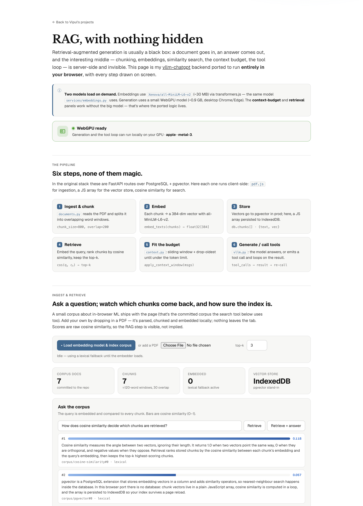
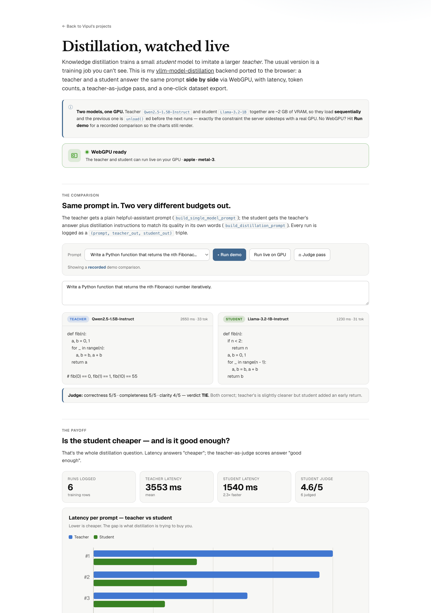

# credo92.github.io

The personal site of **Vipul Srivastava** — and a small collection of LLM playgrounds that
run **100% in your browser**. No server, no API keys: models download once and run locally on
your GPU via WebGPU. Deployed with GitHub Pages.

**Live:** [credo92.github.io](https://credo92.github.io/)

| Page | What it is |
| --- | --- |
| [`/`](https://credo92.github.io/) | **Home** — about Vipul, and a hub linking to every playground. |
| [`/agent.html`](https://credo92.github.io/agent.html) | A Claude Code–style **AI coding agent** that edits a virtual project in a terminal, running on a tiny local model. |
| [`/rag.html`](https://credo92.github.io/rag.html) | A from-scratch **RAG pipeline**, every step drawn on screen. |
| [`/distill.html`](https://credo92.github.io/distill.html) | **Model distillation**, teacher vs student, side by side. |
| [`/evals.html`](https://credo92.github.io/evals.html) | What an **LLM eval** is, with charts you can read. |

---

## 🔍 RAG, with nothing hidden — [`rag.html`](https://credo92.github.io/rag.html)

My [`vllm-chatgpt`](https://github.com/credo92/vllm-chatgpt) backend ported to the client. The
usual RAG black box — chunking, embeddings, similarity search, the context budget, the tool
loop — is made visible.

- **`pdf.js`** ingestion + `documents.py` chunking (overlapping word windows)
- **`Xenova/all-MiniLM-L6-v2`** embeddings via transformers.js — the same model
  `services/embeddings.py` uses — with **cosine similarity** as a pgvector stand-in, the index
  persisted to **IndexedDB**, and retrieved chunks shown with their scores
- **`services/context.py` ported almost line-for-line**: a system-pinned sliding window +
  drop-oldest token-budget compaction, visualized as a live bar with messages falling out of context
- a real **tool loop** (`calculator` + `corpus_search`, with JSON schemas) mirroring the
  `vllm.py` `tool_calls → result → re-call` control flow
- generation via [web-llm](https://github.com/mlc-ai/web-llm) (Qwen2.5-1.5B)

---

## 🧪 Distillation, watched live — [`distill.html`](https://credo92.github.io/distill.html)

My [`vllm-model-distillation`](https://github.com/credo92/vllm-model-distillation) backend,
ported so a teacher and a student answer the same prompt **side by side** on your GPU.

- teacher **Qwen2.5-1.5B** vs student **Llama-3.2-1B** via web-llm, loaded **sequentially** with
  `unload()` between them to respect the ~2 GB VRAM ceiling — with latency + token counts
- `core/prompts.py` templates ported (single-model, distillation, comparison)
- a **teacher-as-judge** pass, charted in the evals SVG style
- every `(prompt, teacher_out, student_out)` triple logged to IndexedDB and exportable as JSON
  in the shape of `GET /prompts/export/project/{id}` — a ready-to-use distillation dataset
- a recorded **demo mode** so the charts render with no download

---

## Notes

- **WebGPU is required for generation.** Desktop Chrome/Edge work best; the pages detect the GPU
  and, if it's missing, disable the model-backed features and explain why — while keeping
  everything that runs on the CPU (RAG retrieval, the context-budget panel, the distillation demo
  and charts) fully working.
- Each page is a single self-contained HTML file — no build step. Model weights are cached by the
  browser after the first load.

Built in Montreal, mostly with AI coding tools in the loop.
